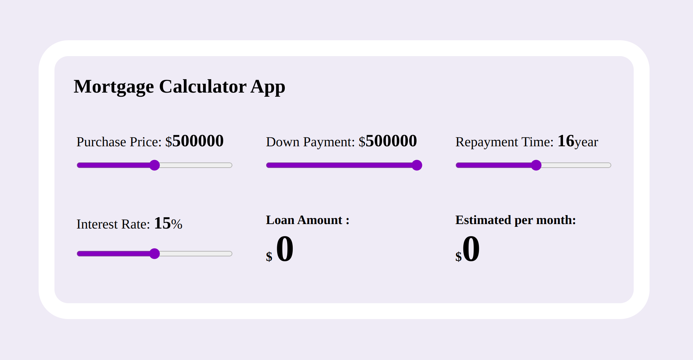

# Mortgage calculator web app
### Made with ❤️ by <a href="https://github.com/uniquesonu">Sonu Kumar</a>

---

This is an open source project from [DevProjects](http://www.codementor.io/projects). Feedback and questions are welcome!

---

> Challenge Link : <a href="https://www.codementor.io/projects/web/mortgage-calculator-web-app-d16bqrq2q3"> Codementor.io </a>

---

## Live Link

<a href="https://uniquesonu.github.io/mortgage-calculator-app/">Deployed on Github Pages</a>

---

## Screenshot

---

